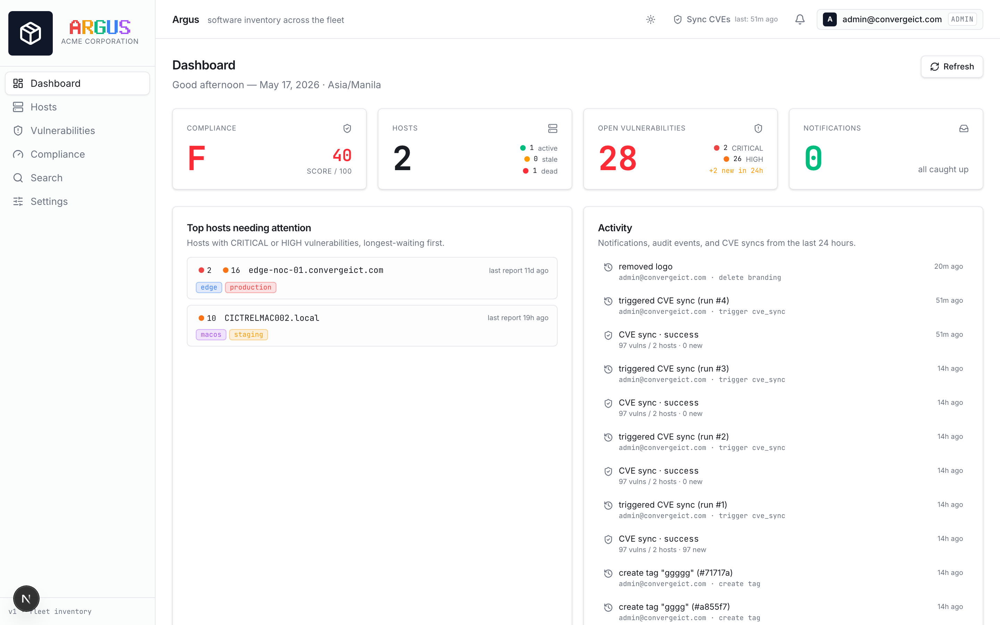
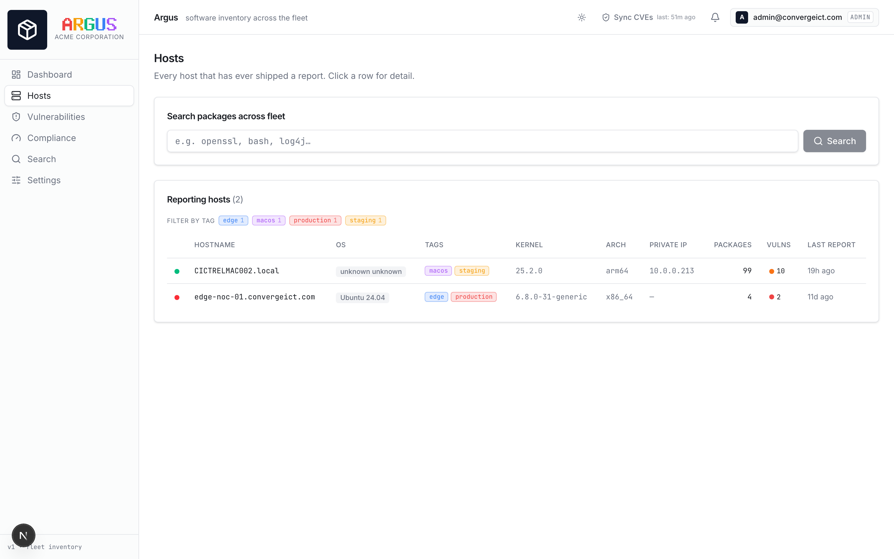
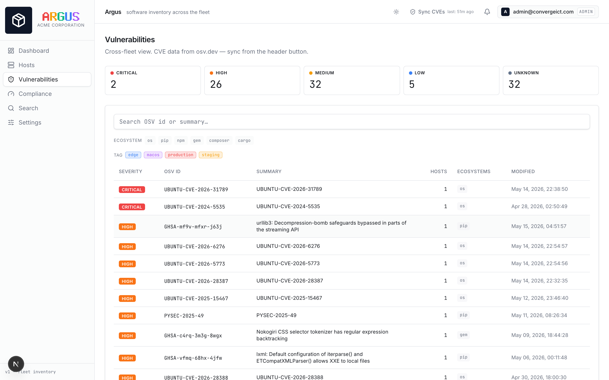
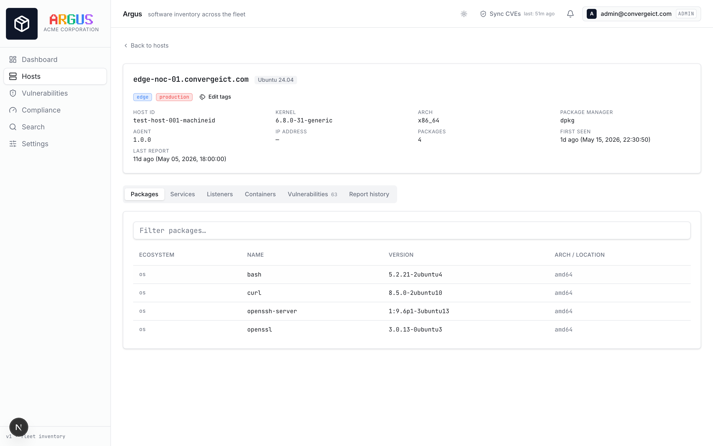
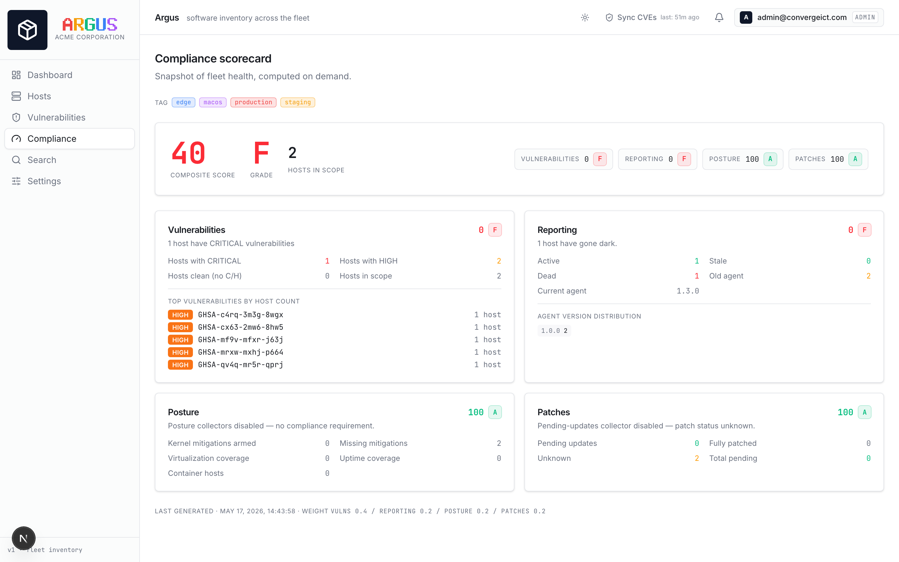
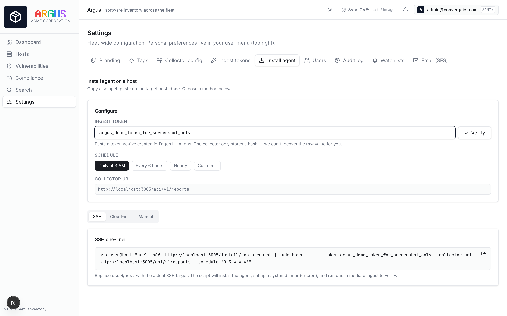
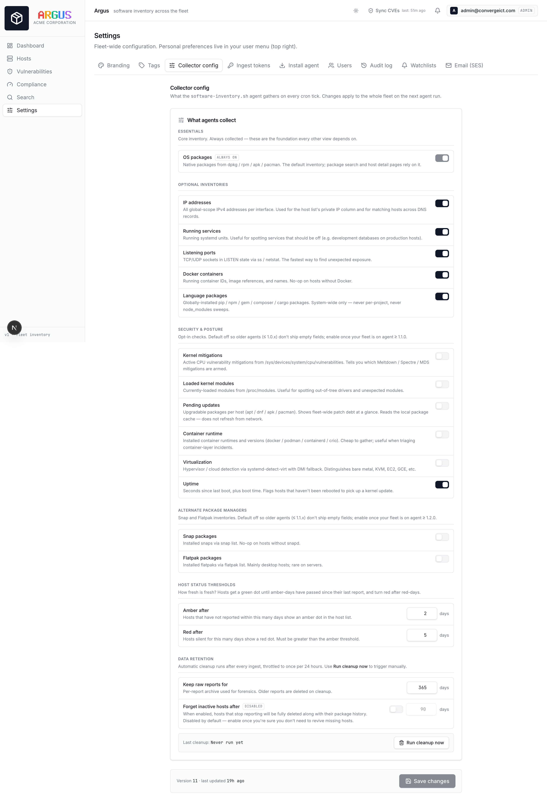

# Argus

> The hundred-eyed watcher for your Linux fleet.

Argus is a self-hosted SBOM (Software Bill of Materials) collector and
vulnerability dashboard. A zero-dependency Bash agent runs on every
host via cron, ships a JSON inventory, and the collector turns it into
something an operator can actually use: package search across the
fleet, CVE matching via OSV.dev, fleet compliance scoring, watchlist
alerts via email, audit logging, and more.

Built for security and ops teams who want SBOM tooling without paying
per-host SaaS fees or running a Java agent on every box.



---

## Screenshots

<table>
  <tr>
    <td><a href="docs/screenshots/hosts-list.png"></a><br/><sub>Hosts list — tag filters, severity dots, per-host vuln counts</sub></td>
    <td><a href="docs/screenshots/vulnerabilities-list.png"></a><br/><sub>Vulnerabilities — severity strip, ecosystem &amp; tag filters, OSV data</sub></td>
  </tr>
  <tr>
    <td><a href="docs/screenshots/host-detail.png"></a><br/><sub>Host detail — packages, services, listeners, containers, vulnerabilities, reports</sub></td>
    <td><a href="docs/screenshots/compliance-scorecard.png"></a><br/><sub>Compliance scorecard — composite grade across four health dimensions</sub></td>
  </tr>
  <tr>
    <td><a href="docs/screenshots/install-agent.png"></a><br/><sub>Install agent — copy-paste SSH / cloud-init / manual snippets</sub></td>
    <td><a href="docs/screenshots/collector-config.png"></a><br/><sub>Collector config — server-driven agent feature toggles</sub></td>
  </tr>
</table>

---

## Highlights

- **Zero-dependency agent.** Pure Bash + POSIX utilities. Works on
  dpkg / rpm / apk / pacman hosts out of the box.
- **Server-driven feature toggles.** Flip a switch in the UI, every
  agent picks up the change on its next cron tick.
- **CVE lookup via OSV.dev.** Free, no auth, covers OS + language
  ecosystems (PyPI, npm, RubyGems, Packagist, crates.io).
- **Compliance scorecard.** Composite grade across vulnerabilities,
  reporting health, posture coverage, and patch hygiene.
- **Watchlist alerts.** Define rules ("notify me on any new CRITICAL
  vulnerability on production hosts"), receive via in-app inbox + AWS
  SES email.
- **Per-host tagging** with multi-tag filtering across every view.
- **Audit log** for every admin mutation.
- **Agent self-update** (opt-in). Hosts compare their script hash
  against the collector on every run and re-exec on mismatch — enabled
  per-host with `INVENTORY_AUTO_UPDATE=1`. Off by default for safety.
- **Branding.** Configurable company name + logo, drag-drop crop tool.
- **Light + dark themes.** Auto-detect or explicit.

## What it inventories

Per host, per cron tick:

| Category               | Source                                          | Default |
|------------------------|-------------------------------------------------|---------|
| OS packages            | `dpkg-query` / `rpm` / `apk` / `pacman`         | on      |
| Language packages      | `pip list` / `npm ls -g` / `gem list` / Composer / Cargo | on |
| IP addresses           | `ip -j addr` (all global-scope IPv4)            | on      |
| Running services       | `systemctl list-units --state=running`          | on      |
| Listening ports        | `ss -tlnp` / `netstat -tlnp` fallback           | on      |
| Docker containers      | `docker ps`                                     | on      |
| Snap / Flatpak packages| `snap list` / `flatpak list`                    | off     |
| Kernel mitigations     | `/sys/devices/system/cpu/vulnerabilities/*`     | off     |
| Loaded kernel modules  | `/proc/modules`                                 | off     |
| Pending updates        | `apt-get -s upgrade` / `dnf check-update` / etc.| off     |
| Container runtimes     | binary probe (docker/podman/containerd/crio)    | off     |
| Virtualization         | `systemd-detect-virt` + DMI fallback            | off     |
| Uptime                 | `/proc/uptime`                                  | off     |

Off-by-default features are opt-in centrally — defaults preserve
agent-side wire-compatibility for older fleets.

## Stack

- **Frontend**: Next.js 16 (App Router) + React 19 + TypeScript +
  Tailwind v4 + shadcn/ui + Lucide
- **Backend**: Next.js Route Handlers + Prisma + SQLite (single
  writer; suitable for fleets up to thousands of hosts)
- **Auth**: HttpOnly cookie JWTs (HS256-pinned), bcrypt cost 12,
  forced password rotation on first login, token-version-based
  revocation
- **Agent ingest**: bearer tokens (32-byte random, bcrypt-hashed,
  prefix-indexed)
- **Email**: AWS SES v2 (optional, admin-configurable in Settings)
- **CVE source**: [osv.dev](https://osv.dev) public API (no auth)

## Quick start

```bash
git clone git@github.com:johnalvero/argus.git
cd argus
npm install
cp .env.example .env       # edit JWT_SECRET (generate with the command in the file)
npm run setup              # migrations + seed; bootstrap password written to prisma/.bootstrap-credentials
npm run dev                # http://localhost:3005
```

The `setup` script is idempotent — safe to re-run; migrations skip
applied ones, seed skips the bootstrap admin if it already exists.

First login forces a password change. Then:

1. **Settings → Branding** — set your company name and logo.
2. **Settings → Ingest tokens** — create a token. The raw value is
   shown **once** at creation — copy it now.
3. **Settings → Install agent** — copy the SSH or cloud-init snippet
   onto a target host.
4. Wait one cron tick (or run the agent manually with `--dry-run`
   first to see the payload).
5. **Click "Sync CVEs"** in the header to pull vulnerability data
   from OSV.

## Installing the agent on a host

Three install methods, all generated for you in **Settings → Install
agent** with your token + collector URL pre-filled.

**SSH one-liner**:

```bash
ssh user@host "curl -sSfL https://argus.example.com/install/bootstrap.sh | \
  sudo bash -s -- --token <TOKEN> \
                  --collector-url https://argus.example.com/api/v1/reports \
                  --schedule '0 3 * * *'"
```

**cloud-init / EC2 user-data**:

```yaml
#cloud-config
runcmd:
  - curl -sSfL https://argus.example.com/install/bootstrap.sh | \
      bash -s -- --token <TOKEN> \
                 --collector-url https://argus.example.com/api/v1/reports
```

**Manual** — the install page walks through each step for air-gapped
or unusual hosts.

The bootstrap script:

1. Downloads the agent to `/usr/local/sbin/software-inventory.sh`.
2. Writes `/etc/inventory-agent/env` with the collector URL + token
   (mode 600).
3. Installs a systemd timer (or cron, on systems without systemd).
4. Runs one immediate ingest to verify the wiring end-to-end.

**Agent self-update is opt-in.** Set `INVENTORY_AUTO_UPDATE=1` in
`/etc/inventory-agent/env` to enable. The agent then checks the
collector-advertised SHA-256 on every cron tick and re-execs on
mismatch — but only if the download URL's host matches the collector
the agent was installed with, so a compromised collector config can't
redirect agents to a different host.

## Configuration

### Environment variables

| Variable                 | Required | Description                                     |
|--------------------------|----------|-------------------------------------------------|
| `DATABASE_URL`           | yes      | SQLite file path, e.g. `file:./prisma/dev.db`   |
| `JWT_SECRET`             | yes      | 32+ random bytes; signs session JWTs only       |
| `ENCRYPTION_KEY`         | no       | 32+ chars for at-rest secrets (SES credentials, etc.). If unset, auto-generated to `prisma/.encryption-key` on first run. **Back this file up** alongside the SQLite DB. |
| `INSECURE_COOKIES`       | no       | Set to `1` for dev over plain HTTP. Never set in production. |
| `TRUST_PROXY`            | no       | Set to `true` when behind nginx / ALB so client IPs come from `X-Forwarded-For`. |
| `AGENT_SCRIPT_PATH`      | no       | Override agent file location served at `/install/agent.sh` |
| `AGENT_BOOTSTRAP_PATH`   | no       | Override bootstrap location                    |
| `PUBLIC_URL`             | no       | Absolute URL used in email templates           |

### Runtime configuration (all in the admin UI)

- **Collector config** — agent feature toggles (single source of truth
  for the fleet), display thresholds (stale-dot days), data retention,
  cleanup interval.
- **Branding** — company name, logo upload with crop/zoom.
- **Tags** — host tag taxonomy.
- **Email (SES)** — region, access key, secret, sender, test send.
- **Watchlists** — alerting rules.

## Architecture

```
                       ┌─────────────────────────────────┐
                       │      Argus collector (Next)     │
                       │  port 3005, single SQLite file  │
                       └───────────┬─────────┬───────────┘
                                   │         │
                  ingest │         │ admin/operator UI
                                   │         │
    ┌──────────────┐  POST   ┌─────┴───┐  browser  ┌────────────┐
    │ agent on     │────────▶│ /api/v1 │           │  operator  │
    │ /etc/cron.d  │  JSON   │ /reports│           │ (HTTPS UI) │
    │ + systemd    │◀────────│ /config │           └────────────┘
    └──────────────┘  config └─────────┘
                                   │
                                   ▼
                            ┌────────────┐
                            │  osv.dev   │   (CVE lookup, admin-triggered)
                            └────────────┘
                                   │
                                   ▼
                            ┌────────────┐
                            │  AWS SES   │   (optional, watchlist alerts)
                            └────────────┘
```

**Storage model**: every report payload is stored opaque-as-JSON in
`Report.payload`. A denormalized `HostPackage` index is rebuilt per
host on each ingest, so fleet-wide package search is a single indexed
scan. CVE matches live in `Vulnerability` + `HostVulnerability`,
populated on each Sync CVEs click.

**Retention**: configurable per-report retention (default 30 days) and
optional inactive-host expiry (off by default). A 24h-throttled
cleanup runs at the end of every ingest.

## API surface

### Public (no auth — internal-network use assumed)

- `GET /install/agent.sh` — the inventory script
- `GET /install/bootstrap.sh` — the host-side installer

### Ingest (bearer token)

- `POST /api/v1/reports` — submit a report
- `GET  /api/v1/config` — fetch the agent's effective configuration

### UI auth (cookie JWT)

- `POST /api/auth/login` / `logout` / `change-password`
- `GET  /api/auth/me`

### Reads (cookie auth, any user)

- `GET /api/hosts` / `GET /api/hosts/[id]`
- `GET /api/vulnerabilities` / `GET /api/vulnerabilities/[id]`
- `GET /api/search?package=...&version=...`
- `GET /api/compliance?tag=...`
- `GET /api/dashboard`
- `GET /api/notifications` / per-notification read / read-all
- `GET /api/tags`
- `GET /api/branding` / `GET /api/branding/logo`

### Admin (cookie JWT, isAdmin=true)

Tokens, users, tags, host-tag assignments, branding, collector
config, CVE sync, SES config, watchlists, audit log. Browse the
`src/app/api/admin/*` directory for the full list.

## Deployment

Argus is a single-process Next.js app + a SQLite file. Production
deployment looks like:

1. Build: `npm run build`
2. Copy the repo + `.next/` to the target server.
3. Run as a systemd service: `node node_modules/next/dist/bin/next start -p 3005`.
4. Front with nginx / Cloudflare for TLS.
5. Back the SQLite file up periodically.

A reference `argus.service` unit and nginx vhost are in [`deploy/`](deploy/) if present.

## Development

```bash
npm run dev         # next dev on port 3005
npm run build       # production build (includes `prisma generate`)
npm run lint        # next lint
```

Database migrations are Prisma-managed:

```bash
npx prisma migrate dev --name <description>   # local development
npx prisma migrate deploy                     # production
npx prisma studio                             # browse the DB visually
```

## Security notes

- **Cookie**: `argus_session`, HttpOnly + SameSite=Lax. Renew on every
  login. Server-side revocation via `tokenVersion`.
- **bcrypt cost**: 12 from day one. No 10→12 retrofit plumbing.
- **JWT**: HS256, algorithm-pinned on verify (defends against `alg:
  none` confusion).
- **Forced password rotation** mirrored client-side AND server-side
  (middleware redirect + every protected handler refuses non-rotation
  endpoints).
- **Ingest tokens**: random 32-byte values, bcrypt-hashed at rest.
  Raw token shown exactly once at creation. Current prefix `argus_`;
  legacy `sbom_` prefix tokens still verify.
- **At-rest secrets**: AES-256-GCM via a key from `ENCRYPTION_KEY`
  env var, or auto-generated to `prisma/.encryption-key` (mode 0600)
  on first run. Decoupled from `JWT_SECRET` so session rotation
  doesn't break stored SES credentials. Back the key file up.
- **Bootstrap password**: per-install random value written to
  `prisma/.bootstrap-credentials` (mode 0600) by the seed script.
  Never logged to stdout. Delete the file after first login.
- **Agent self-update**: opt-in via `INVENTORY_AUTO_UPDATE=1`. When
  enabled, download URL host is pinned to the install-time collector
  to defend against hostile config redirects.
- **Logos**: PNG/JPG/WEBP only. SVG rejected (script-execution risk).
- **No CSRF token plumbing in v1** — relies on SameSite=Lax + the
  same-origin browser flow. Fine for internal admin tools; reconsider
  for public-internet exposure.

## Roadmap

Shipped:

- Inventory collection (15+ categories), server-driven toggles
- Tag-based host segmentation
- CVE matching + browse UI + per-host vulns
- Compliance scorecard, dashboard landing
- Watchlist alerts (in-app + SES email)
- Report diff viewer
- Audit log, agent self-update
- Branded UI, dark mode, install wizard

Considered for next rounds:

- SBOM export (CycloneDX / SPDX formats)
- Vulnerability risk-acceptance workflow
- Global Cmd+K command palette
- Slack / Teams webhook integration
- Per-host file integrity hashes, SUID/SGID inventory
- Webhook on events (generic SIEM consumer)
- Historical trend charts (daily compliance snapshots)

## Contributing

This is an internal tool but contributions are welcome via PR. Keep
agent helpers zero-dependency. Keep the SQLite single-writer
assumption. Don't introduce a new JS framework — Next/Prisma/Tailwind
is the stack.

## License

Internal use. Contact the owner before external redistribution.
